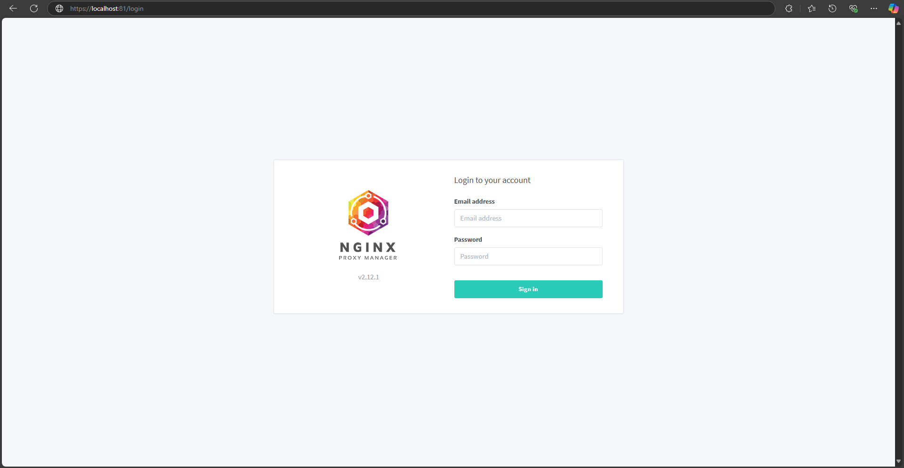

# Script de Instalação do NGINX Proxy Manager

Este script automatiza a instalação do Docker, a remoção do Apache2 (se instalado) e a configuração do NGINX Proxy Manager usando Docker Compose.

## Pré-requisitos

- Sistema operacional: Debian 12.7.0
- Permissões de superusuário (sudo)

## Proxy Manager Login



## Funcionalidades

- Verifica se o Docker está instalado e, se não estiver, instala-o.
- Remove o Apache2, se estiver instalado.
- Configura e inicia o NGINX Proxy Manager usando Docker Compose.

## Uso

1. Clone este repositório ou copie o script `install_proxy.sh` para o seu sistema.
2. Dê permissão de execução ao script:
   ```sh
   chmod +x install_proxy.sh
   ```
3. Execute o script:
   ```sh
   sudo ./install_proxy.sh
   ```

## Estrutura do Script

- **Verificação de Comando**: Verifica se um comando existe no sistema.
- **Instalação do Docker**: Instala o Docker e suas dependências.
- **Remoção do Apache2**: Remove o Apache2, se estiver instalado.
- **Configuração do NGINX Proxy Manager**: Cria um arquivo `docker-compose.yml` e inicia o NGINX Proxy Manager.

## Requisitos de Sistema

| Recurso         | Requisito Mínimo | Requisito Recomendado |
| --------------- | ---------------- | --------------------- |
| Memória RAM     | 512 MB           | 4 GB                  |
| Espaço em Disco | 20 GB            | 50 GB                 |

## Uso de Memória RAM para Domínios Simultâneos

| Número de Domínios | Memória RAM Necessária |
| ------------------ | ---------------------- |
| 1-5                | 512 MB                 |
| 6-10               | 1 GB                   |
| 11-20              | 2 GB                   |
| 21-50              | 4 GB                   |
| 51+                | 8 GB                   |

## Notas

- Certifique-se de que você tem uma conexão com a internet durante a execução do script.
- O script deve ser executado com permissões de superusuário.

## Exemplo de Saída

```sh
Docker não encontrado, iniciando a instalação...
...
Docker foi instalado com sucesso.
Apache2 encontrado, removendo...
...
Apache2 foi removido com sucesso.
NGINX Proxy Manager foi configurado e está em execução.
```

## Autor

- Matheus Marinho de Oliveira

## Licença

Este projeto está licenciado sob a Licença MIT - veja o arquivo [LICENSE](LICENSE) para mais detalhes.
